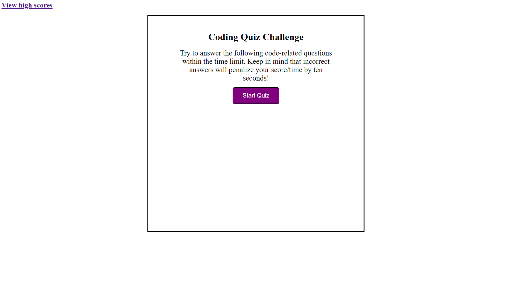
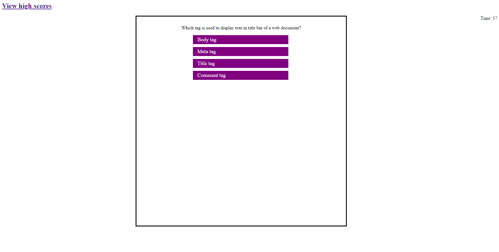
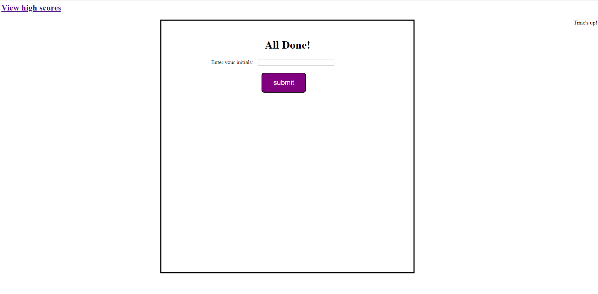
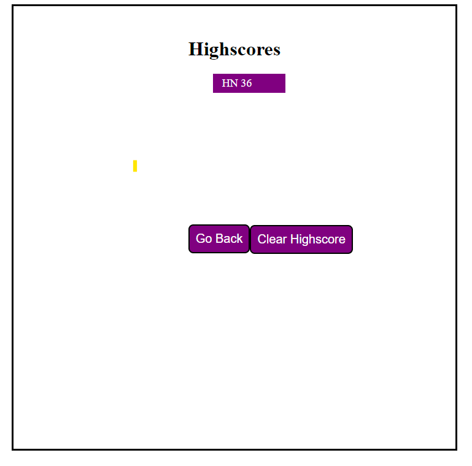

# WebDevQuiz

This is a quiz application using HTML, CSS, and Javascript. This application emphasizes the use of Javascript to provide quiz questions and collect user data to determine whether the answers to a question are correct, this then generates a score and appends a final page of results from the user data.

* [GitHub Repository](https://github.com/idahuy/WebDevQuiz)
* [Deployed GitHub IO](https://idahuy.github.io/WebDevQuiz/)

### Summary
* HTML and CSS and Javascript documents create a quiz with multiple choice questions with Javascript trivia
* This project emphasizes the use of using Javascript to make dynamic changes to an HMTL document
* This project utilizes the use of appending HTML pages 

### This project has the following features: 
* An appended HTML page that features questions, and multiple choice answers
    * If questions are answered incorrectly, 5 seconds are deducted off remaining time
    * Answers are recording using an event listener, "click" and tracks correct answers
    * Final score which is calculated using time remaining
    * Submit buttom saves initials and score to local storage

* A Highscores HTML
    * This a list summary of intials and final scores
    * Clear button resets the page and local storage
    * Go back button travels to the start of the quiz

### Features: 
* Two HTML Pages
    * Index.html 
        * Contains landing page to start timer
        * Appends two new pages 
* Highscores 
        * Retreives local data from previous page
* One CSS Page
    * Styles.css
        * Contains centering and styling for html list features
        * Contains media queries
* Two Javascript Page
        * Contains: 
        * Variables, including arrays with object
        * Event listeners
        * if/else if statements
        * For Loops
        * Functions 
        * Local Storage set and get 

### Screenshots
Start of the game

Quiz

End of the game

Highscores

## Authors

* **Huy Nguyen**